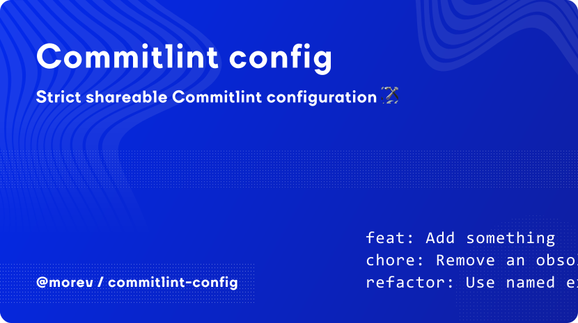

[](https://opensource.org/licenses/MIT)


# @morev/commitlint-config

Shareable [`commitlint`](https://commitlint.js.org/) configuration.

## Table of contents:

* [Installation](#installation)
  * [Using `yarn`](#using-yarn)
  * [Using `npm`](#using-npm)
  * [Using `pnpm`](#using-pnpm)
* [Usage](#usage)
  * [Basic usage](#basic-usage)
  * [Advanced usage](#advanced-usage)
* [Built-in type enum](#built-in-type-enum)

## Installation

### Using `yarn`

```bash
yarn add @morev/commitlint-config
```

### Using `npm`

```bash
npm install @morev/commitlint-config
```

### Using `pnpm`

```bash
pnpm add @morev/commitlint-config
```

## Usage

### Basic usage

Create a `.commitlintrc.cjs` file in the project root:

```bash
echo -e "module.exports = {\n\textends: ['@morev/commitlint-config'],\n\trules: {},\n};" > .commitlintrc.cjs
```

The command above will create a `.commitlintrc.cjs` file with the following content:

```js
module.exports = {
  extends: ['@morev/commitlint-config'],
  rules: {},
};
```

> It's recommended to create `.commitlintrc.cjs` file instead of `commitlint.config.js` because by using
> this naming strategy you can keep your Commitlint configuration file consistent across packages
> regardless of whether the package has `"type": "module"` or `"type": "commonjs"`.

### Advanced usage

If you need fine-grained control, you can import the entire config directly and manipulate it as a JavaScript object:

```js
const config = require('@morev/commitlint-config');

// Replace the `header-min-length` rule with custom settings
config.rules['header-min-length'] = [2, 'always', 5];

module.exports = config;
```

Also you can use the built-in utility to modify `type-enum` rule for each project in a more elegant way:

```js
const { modifyTypeEnum } = require('@morev/commitlint-config/utils');
const config = require('@morev/commitlint-config');

module.exports = modifyTypeEnum(config, {
  add: ['temp'],
  remove: ['nvm'],
});

// Now you can use `temp` as a type and cannot use `nvm`, rest types remain as is.
```

## Built-in type enum

| type       | Description |
| -----------|-------------|
| `feat`     | A new feature related to a production code. |
| `fix`      | A bug fix related to a production code. |
| `refactor` | A production code change that neither fixes a bug nor adds a feature. |
| `perf`     | A less generic subset of `refactor`, a code change that improves performance. |
| `test`     | Adding new/missing tests or correcting existing tests. |
| `docs`     | Documentation changes. |
| `chore`    | Updating accompanying code (linters, builders, library versions, etc.) without affecting the production code. |
| `ci`       | A less generic subset of `chore` related to CI changes only. |
| `release`  | A less generic subset of `chore` related to changes that only bumps the version and update `CHANGELOG.md`. |
| `revert`   | Used for commits that revert another commit. |
| `wip`      | Shortened form of **work in progress** <br />For commits that should be in the public repository but represent a feature that is not yet ready. |
| `nvm`      | Shortened form of **nevermind** <br />For commits that have no value to other developers, which can be skipped when analyzing changes. |
| `build`    | Not recommended to use nowadays. <br />Used for legacy projects that provide build artifacts as part of the repository. |
